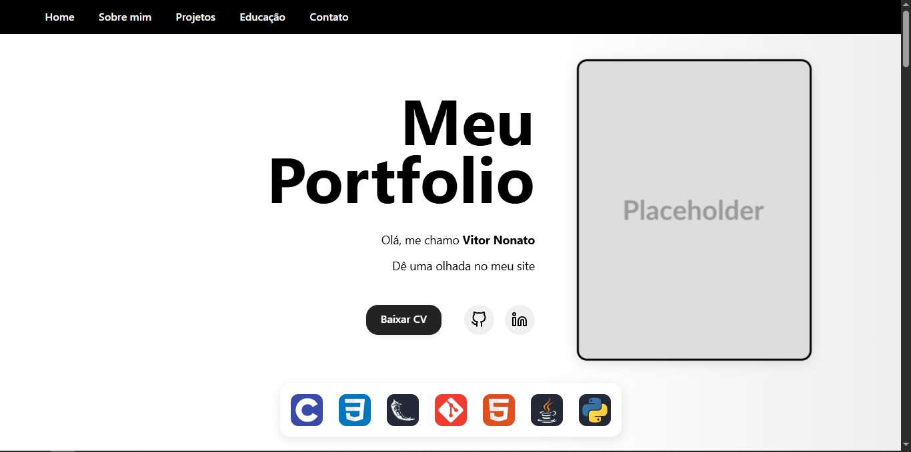
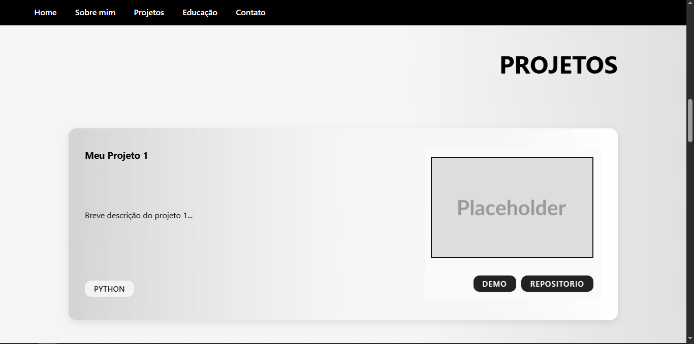

<div align="right">
    <a href="./README.en.md">🇺🇸 Read in English</a>
</div>

<div align="center">
    
</div>

<p align="center">
    Um site de portfólio dinâmico e moderno, desenvolvido com Python e Flask, apresentando projetos, formação e informações de contato de forma interativa.
</p>

---

## Sobre o Projeto

Este é um projeto de um site de portfólio pessoal Single Page Application. O objetivo é apresentar de forma profissional e visualmente atraente as habilidades, projetos e a trajetória de um desenvolvedor.

Todo o conteúdo do site, como informações pessoais, links de redes sociais, projetos e formação, é gerenciado de forma centralizada através de um único arquivo de configuração em Python (`config.py`), tornando as atualizações simples e rápidas, sem a necessidade de alterar o código HTML.

### Vídeo de Demonstração

Assista a uma demonstração completa do site em funcionamento:

<p align="center">
  <a href="https://youtu.be/AwQg6tu3Gfo" target="_blank">
    
  </a>
  <br>
  <em>Clique na imagem para ver o vídeo</em>
</p>

---

### Tecnologias e Conceitos Chave

-   **Backend** Utilizado para servir a aplicação web e processar o envio de e-mails do formulário de contato.
-   **Frontend:**
    -   **HTML com Jinja2:** Permite a renderização dinâmica do conteúdo a partir do backend.
    -   **CSS3:** Animações, layout responsivo com Flexbox, e variáveis CSS para um design consistente. Inclui efeitos visuais como gradientes animados e transições suaves.
    -   **JavaScript:** Usado para interatividade, como as animações que são ativadas ao rolar a página (`IntersectionObserver`).
-   **Flask-Mail:** Biblioteca que integra o envio de e-mails via SMTP, utilizada para fazer o formulário de contato funcionar.
-   **Arquitetura de Conteúdo Centralizado:** O arquivo `config.py` atua como uma única fonte de verdade para todo o texto e dados do site, facilitando a manutenção e personalização.
-   **Segurança:** O arquivo `secrets_email.py` é usado para armazenar credenciais sensíveis, separando-as do código-fonte principal(Não está no repositório, deve-se criar um próprio.)

---

### Recursos Principais

-   **Conteúdo Dinâmico:** Todas as seções são geradas a partir do arquivo `config.py`.
-   **Animações de Scroll:** Elementos aparecem  na tela conforme o usuário rola a página.
-   **Seção Home Interativa:** Apresenta informações do desenvolvedor, links para redes sociais e uma barra de tecnologias.
-   **Cards de Projeto Detalhados:** Cada projeto pode exibir descrição, tecnologias usadas, galeria de imagens e links para "DEMO" e "REPOSITÓRIO".
-   **Formulário de Contato Funcional:** Envia um e-mail diretamente para o dono do portfólio através de um backend seguro.

---

### Capturas de Tela

<p align="center">
  
  <br>
  <em>Seção de apresentação inicial.</em>
</p>

<p align="center">
  
  <br>
  <em>Seção de projetos com cards detalhados.</em>
</p>

---

## Como executar o código fonte

Para executar este projeto localmente, siga os passos abaixo.

### Pré-requisitos

-   Python 3.x instalado no seu sistema.
-   `pip` (gerenciador de pacotes do Python).

### Instalação e Execução

1.  **Clone o repositório:**
    ```sh
    git clone https://github.com/NONATO-03/portfolio.git
    ```

2.  **Navegue para o diretório do projeto:**
    ```sh
    cd meu-portfolio
    ```

3.  **Crie e ative um ambiente virtual (recomendado):**
    ```sh
    # Windows
    python -m venv venv
    .\venv\Scripts\activate

    # macOS / Linux
    python3 -m venv venv
    source venv/bin/activate
    ```

4.  **Instale as dependências:**
    ```sh
    pip install -r requirements.txt
    ```

5.  **Configure as variáveis de ambiente para o e-mail:**
    Você precisa criar um arquivo chamado `secrets_email.py` na raiz do projeto e preencher com as suas informações, seguindo o modelo abaixo.

    **Importante:** Se você usa o Gmail, precisa gerar uma **"Senha de App"** em vez de usar sua senha normal. [Acesse as configurações da sua Conta Google](https://myaccount.google.com/apppasswords) para criar uma.

    ```python
    # secrets_email.py

    MAIL_SERVER = 'smtp.gmail.com'
    MAIL_PORT = 465
    MAIL_USE_TLS = False
    MAIL_USE_SSL = True
    MAIL_USERNAME = 'seu-email@gmail.com'
    MAIL_PASSWORD = 'sua_senha'
    MAIL_RECIPIENT = 'email-para-onde-as-mensagens-serao-enviadas@exemplo.com'
    ```

6.  **Execute a aplicação:**
    ```sh
    python app.py
    ```
    Abra seu navegador e acesse `http://127.0.0.1:5000` para ver o site.

---

### Autor

Desenvolvido com ❤️ por **Vitor Nonato Nascimento**.

-   **GitHub:** [https://github.com/NONATO-03](https://github.com/NONATO-03)